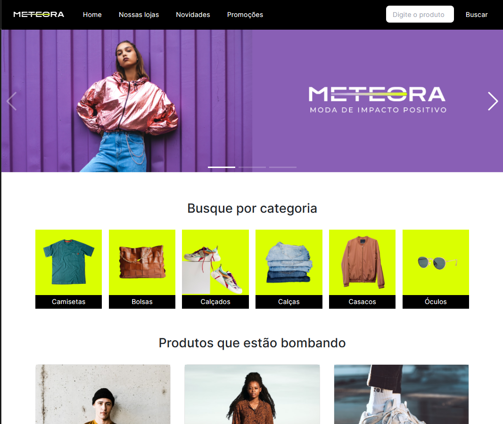

# METEORA - E-COMMERCE

  

## Descrição

E-commerce de uma loja de roupas chamada METEORA. Possui produtos como: Camisetas, Bolsas, Calçados e entre outros. Possui filtro por categoria e também por nome do produto. Utiliza uma fake API para poder gerar os dados dinamicamente.

### Screenshot

### Tecnologias utilizadas:

## Autor

- Linkedin - [Guilherme Vitória](https://www.linkedin.com/in/glsvitoria/)
- GitHub - [glsvitoria](https://github.com/glsvitoria)
- Instagram - [glsvitoria](https://www.instagram.com/glsvitoria/)
